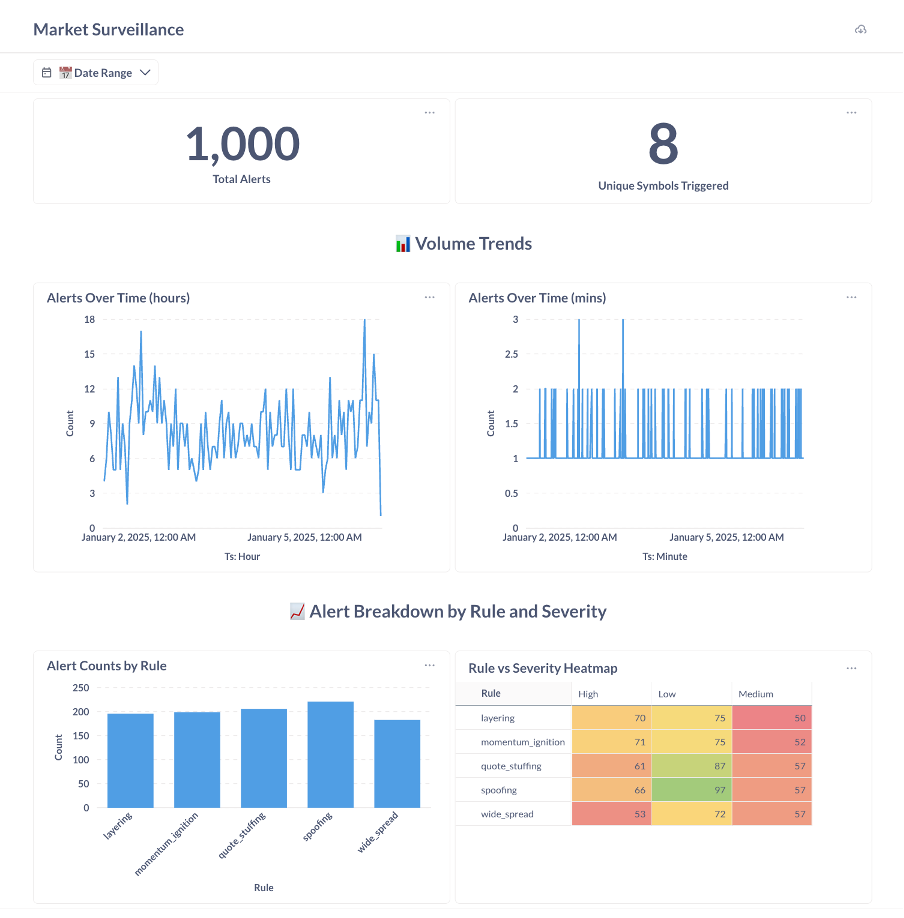
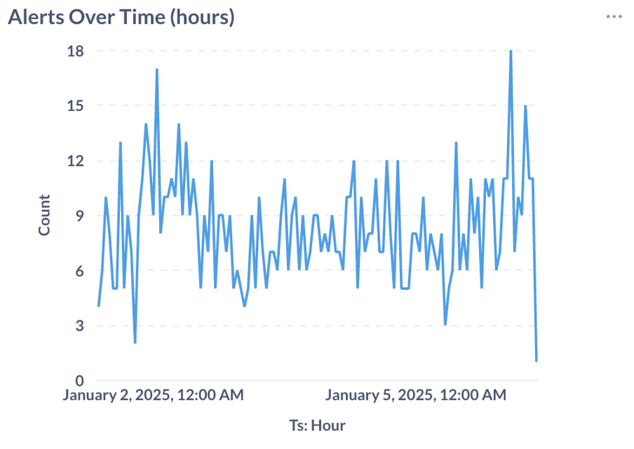
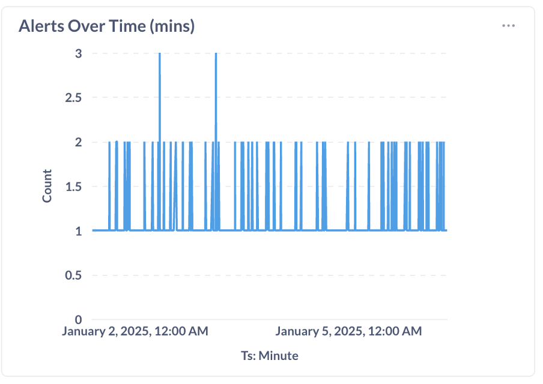
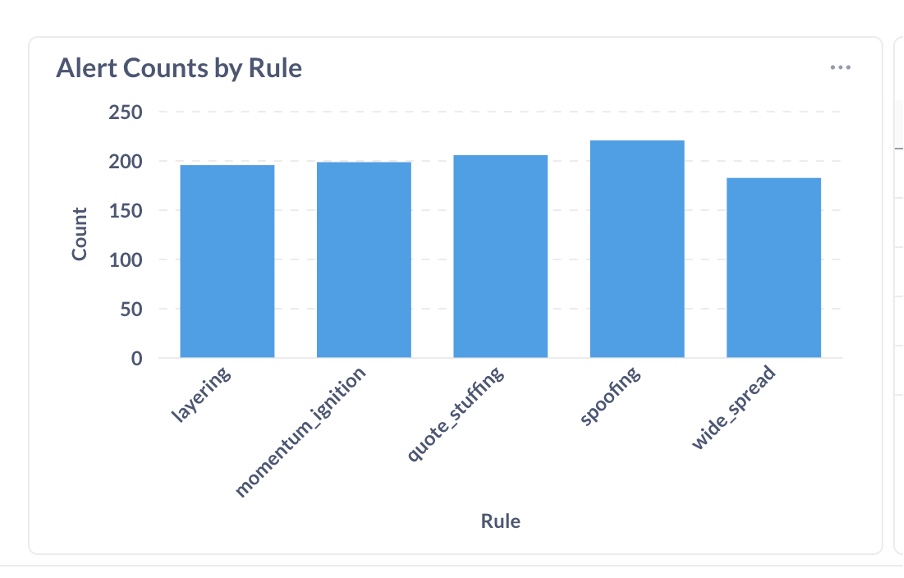
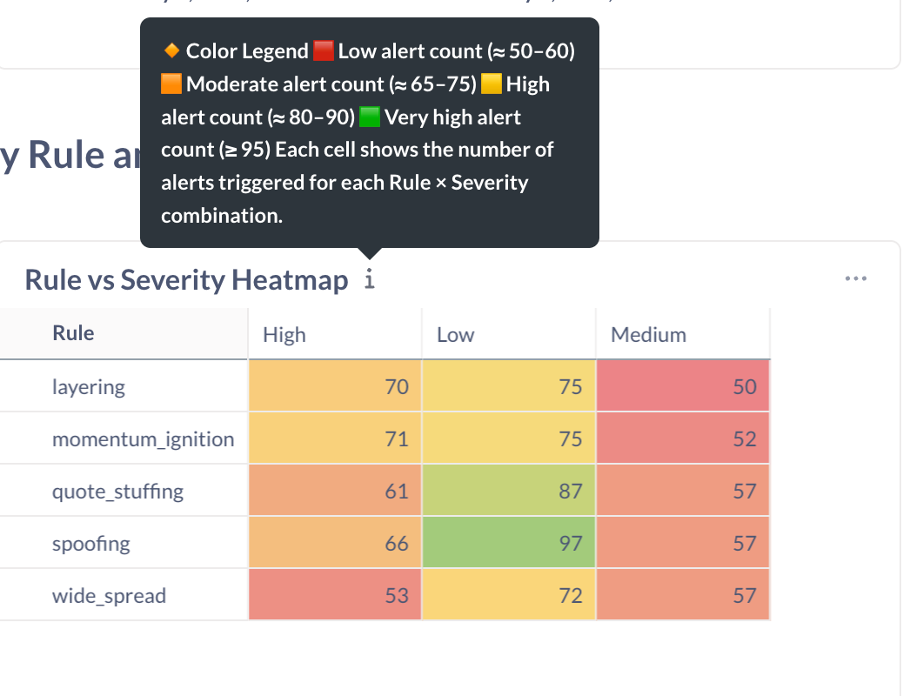

# 🧠 Market Surveillance Dashboard – Data Engineering MVP for Stock Exchange

A **Data Engineering and Analytics prototype** designed to simulate a **Stock Exchange Market Surveillance System**, which is used to monitor and detect **trading irregularities, spoofing, and layering patterns**.

This project demonstrates how trade alerts can be ingested, processed, stored, and visualized using a **modern data stack** (Airflow, Docker, Python, PostgreSQL, Metabase).

---

## 🚀 Project Overview

**Objective:**  
To design an **end-to-end data pipeline** that continuously monitors market trades, applies surveillance rules, detects anomalies, and visualizes alerts in real-time.

This **MVP prototype** proves how a stock exchange surveillance workflow can be built using open-source tools.  
It uses **Apache Airflow** for **ETL orchestration**, **DBT (Data Build Tool)** for **modular data transformation**, **PostgreSQL** for **storage**, and **Metabase** for **visualization** — all containerized using **Docker Compose**.

---

## 🧩 Real-World Relevance

In live markets, exchanges must identify manipulation patterns such as:
- **Spoofing:** placing large fake orders to mislead prices  
- **Quote Stuffing:** flooding the market with rapid-fire orders  
- **Momentum Ignition:** triggering short-term price movements  
- **Wide Spread Violations:** abnormally large bid-ask spreads  

This project models those detection mechanisms using mock data —  
showing how they can be **automated, tracked, and visualized**.

---

## ⚙️ Tech Stack

| Tool / Service | Purpose |
|----------------|----------|
| 🐍 **Python** | Cleanses raw market data and computes rule-based alerts |
| 🪶 **Apache Airflow** | Orchestrates ETL jobs for data ingestion and rule execution |
| 🐘 **PostgreSQL** | Stores structured alert data and trade metrics |
| 🐳 **Docker** | Containerizes Airflow, PostgreSQL, and Metabase for portability |
| 📊 **Metabase** | Builds an interactive Market Surveillance dashboard |

---

## 🧱 Architecture

```text
         ┌────────────────────────┐
         │     Market Trades      │
         │  (raw CSV / stream)    │
         └──────────┬─────────────┘
                    │
            [ETL Pipeline - Airflow]
                    │
                    ▼
         ┌────────────────────────┐
         │  Python Processing     │
         │  - Apply surveillance  │
         │    rules (spoofing etc)│
         └──────────┬─────────────┘
                    │
                    ▼
         ┌────────────────────────┐
         │   PostgreSQL Database  │
         │  (alerts, metadata)    │
         └──────────┬─────────────┘
                    │
                    ▼
         ┌────────────────────────┐
         │  Metabase Dashboard    │
         │  (visual analytics)    │
         └────────────────────────┘
```
---

## 📊 Dashboard Overview (Metabase)

The **Market Surveillance Dashboard** aggregates trade anomalies into visually rich insights.

### 📈 Total Alerts and Symbols
Shows the total number of alerts generated and unique instruments affected.



---

### ⏰ Alerts Over Time (Hourly)
Visualizes hourly alert trends to detect active trading periods or manipulation bursts.



---

### ⏱ Alerts Over Time (Minutes)
Provides minute-level granularity for short-term anomaly spikes.



---

### ⚙️ Alert Counts by Rule
Breakdown of alerts by rule type (spoofing, layering, quote stuffing, etc.)



---

### 🔥 Rule vs Severity Heatmap
Color-coded heatmap showing alert frequency and severity across all surveillance rules.



---

## 🧠 How It Works

1. **Data Ingestion (Airflow):**  
   - Airflow DAGs simulate continuous trade data ingestion from CSV or APIs.  
   - Cleans timestamps, normalizes symbol names, and formats order types.

2. 2. Data Transformation (**DBT**):
   - Runs `dbt run` to clean, model, and aggregate trade data
   - Produces analytics-ready tables/views consumed by Metabase  
   - Generates alert tables with fields like:

3. **Storage (PostgreSQL):**  
   - Stores structured alerts for querying and trend analysis.  
   - Indexed by rule type and symbol for efficient aggregation.

4. **Visualization (Metabase):**  
   - Connects directly to PostgreSQL using JDBC.  
   - Interactive dashboards with filters (date range, rule type, severity).  
   - Enables compliance officers to view anomalies and take corrective action.

---

## 🧮 DBT Quickstart (local)

```bash
# From repo root (adjust path if profiles.yml expects env vars)
cd dbt
dbt deps
dbt build   # or: dbt run && dbt test
```
 - Configure connection in dbt/profiles.yml to your local PostgreSQL (from docker-compose).
 - Point Metabase to the DBT models/tables produced in PostgreSQL.
   
---

## 💻 Local Setup (Docker)

1️⃣ Clone the repository**
```bash
git clone https://github.com/<your-username>/market-surveillance-dashboard.git
cd market-surveillance-dashboard
```
2️⃣ Start Containers (if docker-compose.yml exists)
```bash
docker compose up -d
```
3️⃣ Access the Services
| 🧩 **Service** | 🌐 **URL** |
|----------------|-------------|
| 🪶 **Airflow UI** | [http://localhost:8080](http://localhost:8080) |
| 📊 **Metabase UI** | [http://localhost:3000](http://localhost:3000) |
| 🐘 **PostgreSQL** | `localhost:5432` |

4️⃣ Default Credentials
| 🧩 **Service** | 👤 **Username** | 🔒 **Password** |
|----------------|----------------|-----------------|
| 🪶 **Airflow** | `airflow` | `airflow` |
| 🐘 **Postgres** | `admin` | `admin` |

---
## 📁 Repository Structure
```bash
MARKET-MVP/
│
├── api/                        # REST API for alerts and rule retrieval
│   ├── Dockerfile
│   ├── main.py                 # FastAPI app exposing surveillance endpoints
│   └── requirements.txt
│
├── dags/                       # Airflow DAGs for ETL + rule orchestration
│   ├── __pycache__/
│   └── market_surveillance_mvp.py
│
├── data/                       # Data assets
│   ├── raw/                    # Raw or synthetic trade/order data
│   └── reports/                # Generated market surveillance reports
│
├── dbt/                        # Data transformation layer
│   ├── logs/
│   ├── models/                 # DBT models for data cleaning & aggregation
│   ├── target/
│   ├── .user.yml
│   ├── dbt_project.yml
│   └── profiles.yml
│
├── docker/airflow/             # Airflow Docker image configuration
│   └── Dockerfile
│
├── scripts/                    # Orchestration and utility scripts
│   └── docker-compose.yml      # Multi-service local deployment
│
├── screenshots/                # Dashboard and workflow visuals
│
└── README.md                   # Documentation and usage instructions
```
## 🌍 Future Enhancements

- Integrate live market data streams (Kafka / WebSocket API)
- Deploy on AWS ECS + RDS + S3 + Glue
- Add ML-based anomaly detection (e.g., Autoencoders for pattern drift)
- Implement alert notifications via Slack / SES / SMS

## 🧩 Real-World Implementation Possibility

This MVP can evolve into a production-scale Surveillance Platform used by regulatory and compliance teams in real stock exchanges.

| ⚙️ **Module** | 🌍 **Real-World Use Case** |
|----------------|-----------------------------|
| 🪶 **Ingestion (Airflow)** | Pulls trade & order data from FIX/ITCH feeds in real-time |
| 🧮 **Transformation (DBT)** | Cleans, models, and aggregates data into analytical tables |
| 🐍 **Processing (Python)** | Applies statistical or ML-based anomaly detection |
| 🐘 **Storage (Postgres / Redshift)** | Maintains historical alerts for compliance |
| 📊 **Visualization (Metabase / QuickSight)** | Enables dashboards for analysts & regulators |
| ⚡ **Automation (Lambda / Step Functions)** | Schedules alert generation & reporting workflows |

## 📌 Notes
The dashboard runs locally using Metabase Open Source, not Metabase Cloud.

All visualizations above were generated from synthetic market data.

## 🏁 Summary
This project highlights:

🪶 ETL pipeline design with Apache Airflow

🧮 Data transformation and modeling with DBT  

🐍 Rule-based alert generation using Python

🐘 Relational data management with PostgreSQL

📊 Interactive dashboards in Metabase

🐳 Containerized orchestration using Docker

A complete end-to-end Data Engineering project — simulating a Stock Exchange Market Surveillance System capable of detecting anomalies and visualizing trade alerts in real-time.
